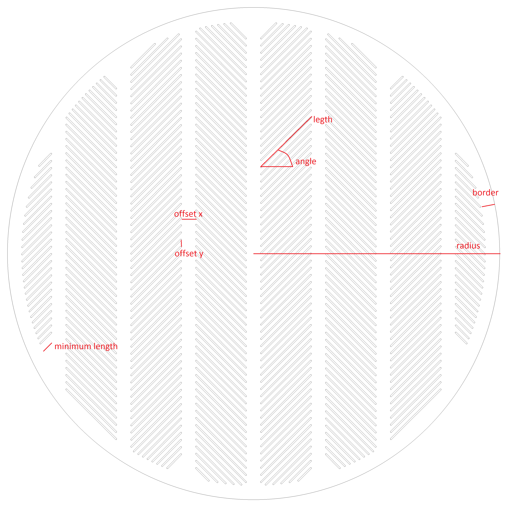

# false_bottom_generator
This is a simple command line tool that is used to generate cutout plan (for a CNC machine) for a lauter tun false bottom.

You will need:
1) falsebottomgenerator.exe executable and falsebottom.cfg config file
2) Cygwin unix shell emulator ( download at https://www.cygwin.com/ ) or cygwin libraries (included in this repository)
3) LibreCAD - this is an opensource 2D CAD software ( download at https://librecad.org/ )

How to generate you own custom false bottom cutout plan:
1) Copy the falsebottomgenerator.exe executable and falsebottom.cfg config file into the same directory
2) If you are not using Cygwin, copy the Cygwin runtime libraries (cygwin1.dll, cyggcc_s-seh-1.dll, cygstdc++-6.dll) also to the same folder
3) Edit the falsebottom.cfg config file (see the picture on the bootom of this page)
4) Run falsebottomgenerator.exe
5) librecad.txt file is generated with the commands for the LibreCAD
6) Start LibreCAD and load the librecad.txt command file
7) Your false bottom is now generated, you can save it in dxf format or export it as pdf or Saving
8) Find a local supplier who can cut you out the false bottom using a CNC laser
9) Enjoy your very own custom false bottom!

